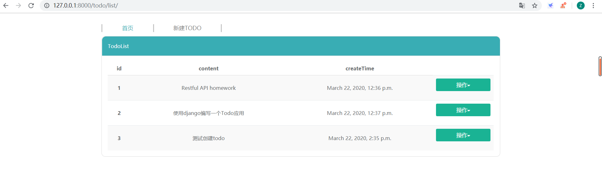
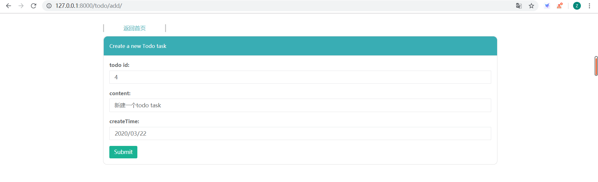
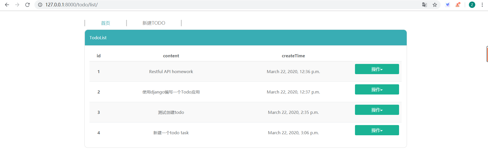
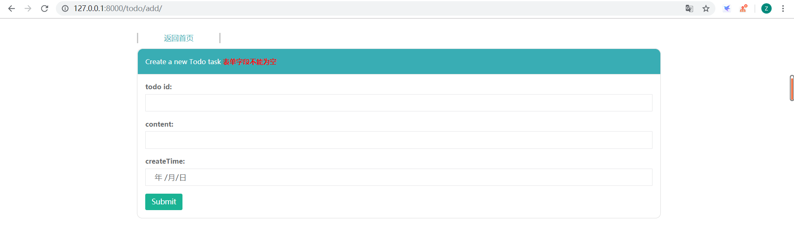
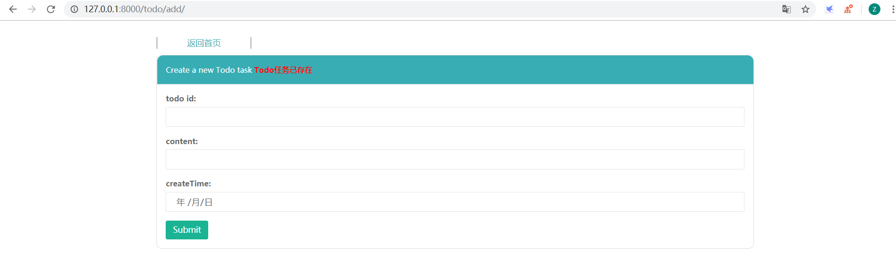
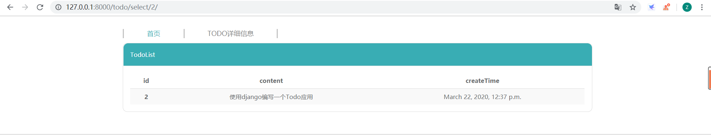
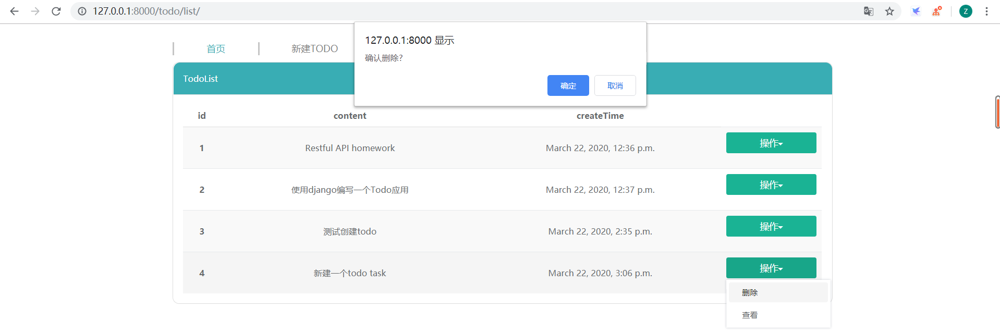

# Todo list
西交2020春敏捷web开发课后作业，构建一个Restful API，编写一个Todo list
## 实现细节
##### 
    $ python 3.7
    $ django 2.2
    $ sqlite3数据库
## 结果截图
### Restful API
#### 一级路由
#####
    $ path('todo/',include('todo.urls'))
#### 二级路由
#####
    $ path('list/',views.index,name = "todolist")
    $ path('add/',views.add,name = 'add')
    $ path('select/<int:todo_id>/',views.select,name='select')
    $ path('delete/<int:todo_id>/',views.delete,name='delete')
#### 运行结果
##### 返回所有Todo任务  

  
##### 创建一个新的Todo任务  

###### 错误信息提示1：表单字段不能为空

###### 错误信息提示2：已存在指定id的todo任务

##### 返回一个指定ID的Todo任务  

##### 删除一个Todo任务

